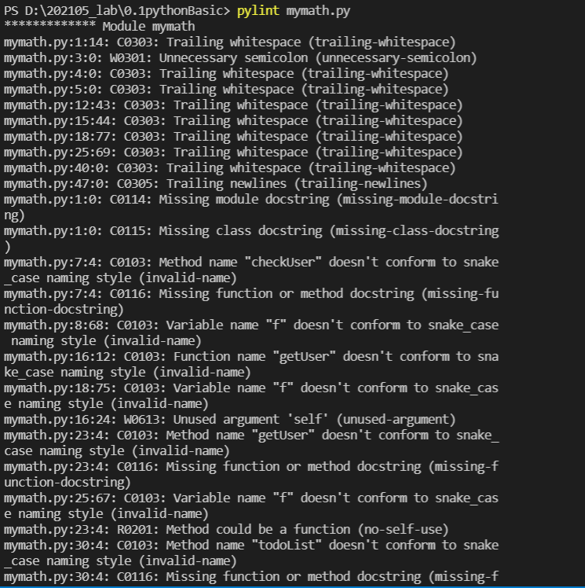
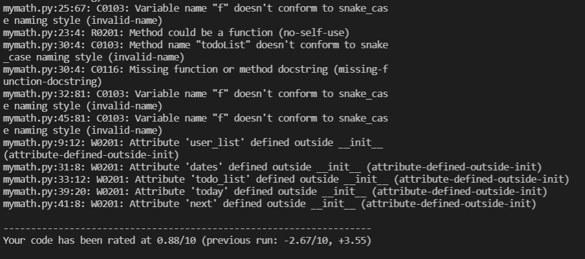
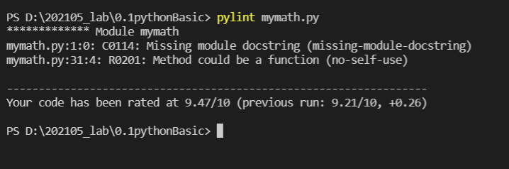

# :memo: To-do list Program 
**&nbsp; &nbsp; Team : 박철희, 이재선, 장수정, 하예진**

<br>

## :white_check_mark: Index
### 1. 주제선정 이유

&nbsp; &nbsp; : Step13 수업까지 들으며 일상생활속에서 자주 쓰이는 To-do list를 구현하는 프로그램을 만들 수 있을 것 같다는 생각이 들어

&nbsp; &nbsp; &nbsp; 이 주제를 선정하게 되었습니다.
 
<br> 
 
### 2. 기능구현
- 등록된 유저인지 체크
 
- 유저등록
 
- 할일등록(내용, 날짜)
 
- 해당 유저의 To-do list 출력
 
<br> 

### 3. Code
```python
class Planner:    
    def __init__(self, name):
        self.name = name;
        
        
    # 등록된 유저인지 체크
    def checkUser(self):
        with open('./DataBase/users.txt', 'r', encoding='utf-8') as f:
            self.user_list = f.read().splitlines()

        if self.name in self.user_list:
            print('반갑습니다:) 회원정보가 확인되었습니다.') 
            print(' ' * 20)
        else:
            print('회원정보가 없습니다. 유저를 등록해주세요.')            
            def getUser(self):
                input_name = input('이름을 입력하세요 : ')
                with open('./DataBase/users.txt','a', encoding='utf-8') as f: 
                    f.write('\n'+input_name)
            getUser(self)

    # 유저 등록
    def getUser(self):
        input_name = input('이름을 입력하세요 : ')
        with open('./DataBase/users.txt','a', encoding='utf-8') as f: 
            f.write('\n'+input_name)


    # 할일등록(내용, 날짜)
    def todoList(self, todo, date):
        self.dates = []
        with open(f'./DataBase/Users/{self.name}.txt', 'r', encoding='utf-8') as f:
            self.todo_list = f.readlines()

        for idx in range(len(self.todo_list)):
            if self.todo_list[idx].startswith('#'):
                self.dates.append(idx)
                if self.todo_list[idx].startswith(f'# {date}'):
                    self.today = idx
                        
        self.next = self.dates.index(self.today)+1
        today_list = self.todo_list[self.today:self.next]
        today_list.insert(1, f'- {todo}\n')
        add_list = self.todo_list[:self.today]+ today_list + self.todo_list[self.next:]
        with open(f'./DataBase/Users/{self.name}.txt', 'w', encoding='utf-8') as f:
            f.writelines(add_list) 
    
    # 해당 유저의 To-do list 출력
    def print_list(self, date):
        with open(f'./DataBase/Users/{self.name}.txt', 'r', encoding='utf-8') as file:
            self.my_list = file.read().splitlines()
        
        for idx in range(len(self.my_list)):
            if self.my_list[idx].startswith('#'):
                self.dates.append(idx)
                if self.my_list[idx].startswith(f'# {date}'):
                    self.today = idx
        self.next = self.dates.index(self.today)+1
        today_list = self.my_list[self.today:self.dates[self.next]]
        for item in today_list:
            print(item)

 ```


### 4. Pylint
- 처음 코드를 pylint에 대입
 
                                    
- pylint를 따라서 코드를 계속 수정
 
<br>

### 5. 최총 Code 실행 결과
```python
class Planner:
    """
    투두리스트를 작성하는 클래스입니다.
    """
    def __init__(self, name):
        self.name = name
        self.next = ""
        self.today = ""
        self.my_list = []
        self.dates = []
        self.user_list = []

    def check_user(self):
        """
        존재하는 유저인지 확인입니다.
        """
        with open('./DataBase/users.txt', 'r', encoding='utf-8') as file:
            self.user_list = file.read().splitlines()
        if self.name in self.user_list:
            print('반갑습니다:) 회원정보가 확인되었습니다.')
            print(' ' * 20)
        else:
            print('회원정보가 없습니다. 유저를 등록해주세요.')
            def get_user(_self):
                input_name = input('이름을 입력하세요 : ')
                with open('./DataBase/users.txt','a', encoding='utf-8') as file:
                    file.write('\n'+input_name)
            get_user(self)

    def get_user(self):
        """
        유저를 등록합니다.
        """
        input_name = input('이름을 입력하세요 : ')
        with open('./DataBase/users.txt','a', encoding='utf-8') as file:
            file.write('\n'+input_name)

    def todo_list(self, todo, date):
        """
        할 일과 날짜를 입력받아서 추가합니다.
        """
        with open(f'./DataBase/Users/{self.name}.txt', 'r', encoding='utf-8') as file:
            self.my_list = file.readlines()
        for idx in range(len(self.my_list)):
            if self.my_list[idx].startswith('#'):
                self.dates.append(idx)
                if self.my_list[idx].startswith(f'# {date}'):
                    self.today = idx
        self.next = self.dates.index(self.today)+1
        today_list = self.my_list[self.today:self.next]
        today_list.insert(1, f'- {todo}\n')
        add_list = self.my_list[:self.today]+ today_list + self.my_list[self.next:]
        with open(f'./DataBase/Users/{self.name}.txt', 'w', encoding='utf-8') as file:
            file.writelines(add_list)

    def print_list(self, date):
        """
        날짜를 입력받아서 유저의 To-do list를 출력합니다.
        """
        with open(f'./DataBase/Users/{self.name}.txt', 'r', encoding='utf-8') as file:
            self.my_list = file.read().splitlines()
        
        for idx in range(len(self.my_list)):
            if self.my_list[idx].startswith('#'):
                self.dates.append(idx)
                if self.my_list[idx].startswith(f'# {date}'):
                    self.today = idx
        self.next = self.dates.index(self.today)+1
        today_list = self.my_list[self.today:self.dates[self.next]]
        for item in today_list:
            print(item)

```

### 6. 추후 보완할 부분
1. 처음 등록한 유저에게는 todo_list()와 print_list()가 작동하지 않는다.
2. pylint에서 두가지에 대한 
 - C0114 : Missing module docstring(missing-module-docstring)
 - R0201 : Method could be a function (no-self-use)
